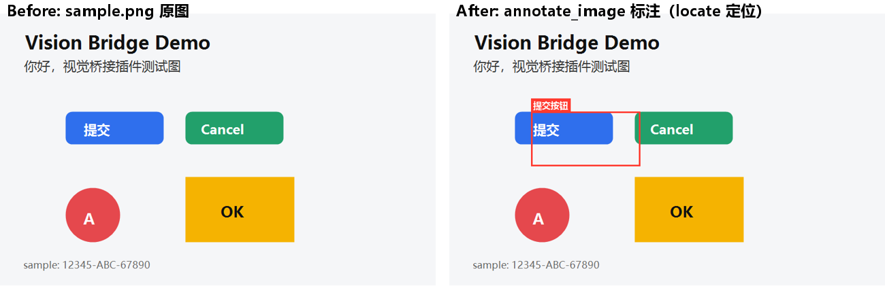
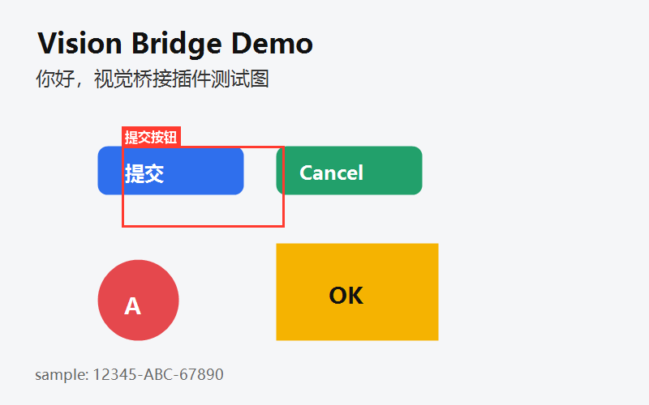
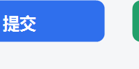

# Codex Vision Bridge v3 — 交互式视觉原语 MCP 插件

让纯文本模型（如 `deepseek-v4-flash`）通过 MCP 工具获得完整"看图 + 操作图片"能力：
**看图 → 定位（输出坐标）→ 圈画标注 → 裁切/放大 → OCR 提取** 的多步交互闭环，处理后的图片可直接交还展示。

视觉后端：**小米 MiMo V2.5**（OpenAI 兼容 API，全模态，支持图片输入与坐标输出）。

- 实现：单文件 Python（`vision_bridge_mcp.py`），依赖仅 Pillow（本机已装 12.2.0），零第三方运行时依赖
- 协议：手写 MCP stdio（JSON-RPC 2.0 + Content-Length 帧），兼容 Codex 桌面端/CLI
- 灵感来源：HanaAgent 的 Vision Bridge（辅助视觉模型 + 结构化"视觉原语"）+ DeepSeek《Thinking with Visual Primitives》（坐标框/点 + 标签）

## 工具一览（9 个）

| 工具 | 作用 | 关键参数 |
|---|---|---|
| `describe_image` | 文字描述图片 | `image` 必填；`question`、`detail`(brief/balanced/detailed) |
| `analyze_image` | 结构化分析：描述 + visual_primitives（box/point+标签+置信度） | `image` 必填；`format`(generic/gemini/qwen) |
| `locate_object` | 定位目标对象，返回坐标（让 LLM 输出坐标） | `image`、`target` 必填；`coords`(pixel/norm) |
| `ocr_image` | 逐文本块 OCR，带 bbox（像素+归一化） | `image` 必填；`language` |
| `annotate_image` | 在图上画框/圆点/标签，保存标注图 | `image`、`items` 必填；`coords`、`out_path`、`style` |
| `crop_image` | 按坐标裁切（可边缘外扩 expand_px） | `image`、`box` 必填；`coords`、`expand_px` |
| `zoom_region` | 区域放大（scale 1-8） | `image` 必填；`box`、`scale` |
| `vision_health` | 检查后端配置与连通性 | 无 |`n| `scan_anomalies` | **自动异常扫描**：切块定位候选 → 高清逐点验证 → 输出带角度/丝印/置信度的报告 | `image` 必填；`target`、`region`、`verify`、`max_tiles` |

坐标系统：所有工具接受 `coords="pixel"`（默认，MiMo 实测更准）或 `coords="norm"`（0–1000 归一化）；越界坐标自动钳制并返回 `clamped: true`。


## 截图演示（Demo）

使用仓库内 `sample.png`（测试样例图）走完整视觉原语工作流的效果：

**定位 + 圈画标注**（`locate_object` 找到"蓝色提交按钮" → `annotate_image` 画框标注）：



**标注输出**（`annotate_image` 返回的标注图）：



**按坐标裁切**（`crop_image`，裁出按钮区域）：



**区域放大**（`zoom_region`，2 倍放大便于细节识别）：


## 安装与配置

### 1. 在 `~/.codex/config.toml` 追加

```toml
# --- MCP: Vision Bridge ---
[mcp_servers.vision-bridge]
command = "python"
args = ['/path/to/vision-bridge-mcp/vision_bridge_mcp.py']
startup_timeout_sec = 60

[mcp_servers.vision-bridge.env]
VISION_API_BASE = "https://api.xiaomimimo.com/v1"
VISION_API_KEY = "sk-你的小米MiMo密钥"
VISION_MODEL = "mimo-v2.5"
VISION_OUTPUT_DIR = '/path/to/vision-bridge-mcp/generated'
```

重启 Codex 后生效，用 `vision_health` 验证。

### 2. 环境变量

| 变量 | 默认 | 说明 |
|---|---|---|
| `VISION_API_BASE` | `https://api.xiaomimimo.com/v1` | OpenAI 兼容端点 |
| `VISION_API_KEY` | （必填） | 小米 MiMo API key |
| `VISION_MODEL` | `mimo-v2.5` | 注意：实测 `mimo-v2.5-pro` 在该 API 上不支持图片输入（404），如需更强视觉能力请在 MiMo 平台确认图像模型名 |
| `VISION_MAX_TOKENS` | `4096` | MiMo 为推理模型，思维链耗 token 多 |
| `VISION_TIMEOUT_S` | `120` | 单次调用超时 |
| `VISION_MAX_IMAGE_MB` | `20` | 图片大小上限 |
| `VISION_CACHE` | `1` | 结果缓存（sha256 图片+问题+模型），设 `0` 关闭 |
| `VISION_SAMPLES` | `1` | >1 时 locate/analyze 多次取样，按空间位置聚类取中位数（更稳，但更慢更贵） |
| `VISION_OUTPUT_DIR` | `generated/` | 生成图片输出目录（out_path 必须在该目录内） |
| `VISION_DEBUG` | `0` | 设 `1` 输出日志到 stderr |

## 交互工作流示例

```text
用户：帮我看一下这张截图里有哪些报错，并把报错位置圈出来
模型（Codex）：
1. ocr_image("screenshot.png")            # 提取文字 + 坐标
2. locate_object("screenshot.png", "报错文字区域")
3. crop_image("screenshot.png", box)      # 裁切细节细看
4. zoom_region("screenshot.png", box, scale=3)
5. annotate_image("screenshot.png", [{label:"报错", box, color:"#ff3b30"}])
   -> 返回标注图路径，Codex 用 Markdown 展示给用户
```

## 实测结论（MiMo V2.5，2026-08-01）

| 能力 | 实测表现 |
|---|---|
| 描述（describe） | 优秀：布局、对象、文字、颜色全部准确 |
| 定位（locate） | 简单几何图形（圆形 [120,320,220,420]）**完全精确**；复杂元素（圆角按钮）偏移约 20-40px —— 建议关键任务开 `VISION_SAMPLES=3` 或切 `mimo-v2.5-pro`，圈画后人工核对 |
| OCR | 英文/数字准确（"Vision Bridge Demo"、"Cancel"、"sample: 12345-ABC-67890"）；中文渲染小字识别为 `??`（MiMo 局限），bbox 精度一般、部分贴边 |
| 标注/裁切/放大 | 程序化像素验证通过（框线命中、裁切尺寸正确） |
| 延迟 | 单次视觉调用约 15-25 秒（MiMo 推理型），完整闭环约 2 分钟 |

## 测试

```bash
# mock 测试（不依赖真实 key，45 项全绿）
python test\run_tests.py

# 真实端到端（需要 VISION_API_KEY）
python test\e2e_mimo.py
```

## 安全说明

- 输入图片只读，不写入/修改原文件；上传仅发往所配置的 MiMo API
- `out_path` 强制限定在 `VISION_OUTPUT_DIR` 内，防止越界写入
- API key 仅存于本地 `~/.codex/config.toml`（与现有 GitHub MCP 的 token 存放方式一致）；若 key 泄露，请到 [MiMo 控制台](https://platform.xiaomimimo.com) 轮换
- 图片大小 ≤20MB，扩展名白名单：png/jpg/jpeg/webp/gif/bmp

## 文件结构

```
vision-bridge-mcp/
├── vision_bridge_mcp.py   # MCP server（单文件实现）
├── sample.png             # 测试样例图
├── README.md
├── .env.example
├── generated/             # 工具生成的图片（e2e 产物）
├── .cache/                # 结果缓存（自动创建）
└── test/
    ├── run_tests.py       # mock 测试套件
    └── e2e_mimo.py        # 真实 MiMo e2e 脚本
```
## scan_anomalies — 自动异常元件扫描（v1.1 新增）

一步完成"找异常元件"的完整流程，无需手动多轮操作：

```text
scan_anomalies(image, target="摆放歪斜、方向与周边不一致的元件",
               region=[x1,y1,x2,y2]?, verify=true, max_tiles=6, overlap=250)
```

工作方式：
1. 把 `region`（默认全图）切成带重叠的块（最多 `max_tiles` 块），逐块 `locate_object` 收集候选（**完整边界框 + rotation 角度 + 全部目标**）
2. 按空间位置合并去重（中心距离 / IoU）
3. `verify=true` 时：每个候选从**原图**高清裁切放大，客观化提问验证（是否歪斜/角度/丝印/类型），解析为结构化判定
4. 输出按"歪斜 → 不确定 → 正常"排序的候选报告

实测（2026-08-01，200MP PCB 板，region 限定右下区域）：4 块扫描 → 3 候选 → 自动验证排除 2 个 → 锁定歪斜元件（A1142C LDO 所在区域，验证判定歪斜 ~30°，丝印 5C）。总耗时约 2 分钟（8 次视觉调用）。

> 已知边界：视觉模型对"歪斜"的检测召回率低、角度估计不稳定（10°~35° 波动），`scan_anomalies` 的价值在于**自动多候选 + 逐点验证排除**，最终仍建议实物核对。大图（如 200MP）请把 `VISION_MAX_IMAGE_MB` 调到文件实际大小（默认 20MB）。

## 实测更新（v1.1，2026-08-01）

- 定位可靠性：单次 `locate_object` 对"歪斜"类目标幻觉率较高（两次测试均需纠错）；**`scan_anomalies` 的多候选+验证流程可自动排除误报**
- 完整边界框：`locate_object`/`scan_anomalies` 输出改为"包含本体+焊盘"的完整框（旧版经常只框到元件局部，如 404×131 实际元件 700×540）
- 角度原语：`rotation` 字段随 primitives 输出（模型估计，仅供参考）
- 网络健壮性：`call_chat` 对连接超时/网络错误也重试 1 次
## v1.2（2026-08-02）

- 新增 `compare_images`：2-4 张图多图对比（A/B 截图、设计稿一致性、多帧分析），图片以多图消息原生送入 MiMo，不拼接不降质；带缓存与参数校验
- 测试增至 **62 项**（mock，不依赖真实 key）
## v1.4（2026-08-02）

- **修复 `sample.png` 中文渲染**：原测试图用 PIL 生成时 CJK 被渲染为 notdef（`?`），导致早期得出"中文 OCR 弱"的错误结论；改用 GDI+（System.Drawing）生成，中文显示与识别均正常
- **修正实测结论**：MiMo V2.5 中文 OCR 正常（高铁站 LED 屏车次/站名、中文按钮文字均正确读取）
- 演示图基于修复后的 `sample.png` 重新生成（标注框来自真实 `locate_object` 定位结果）