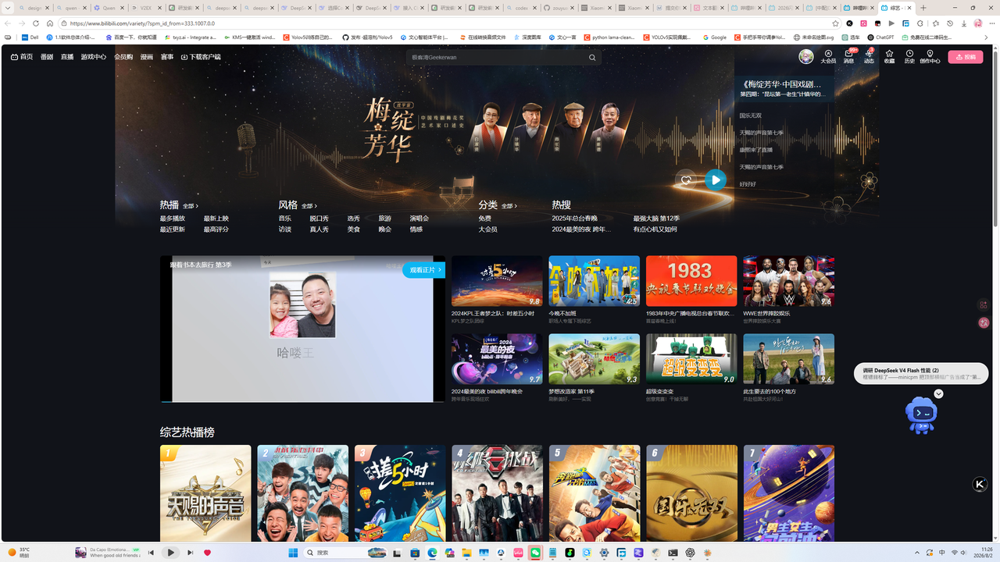
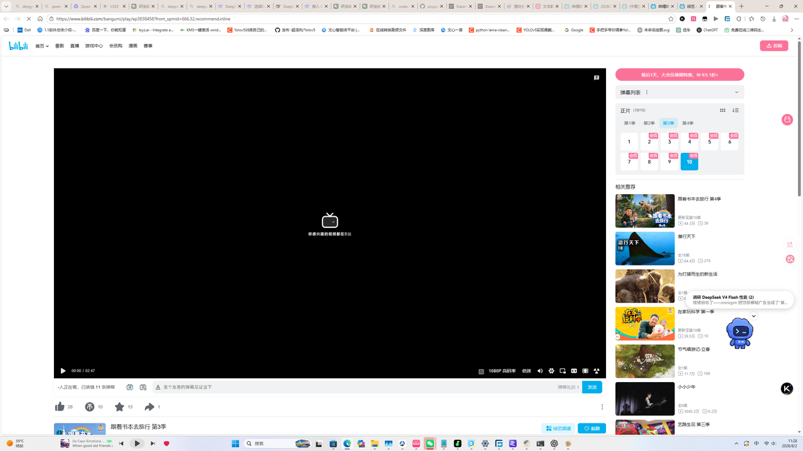

# Computer Use 实战测试报告（2026-08-02）

> 场景：纯文本模型（deepseek-v4-flash）通过 Vision Bridge MCP 完成真实电脑控制闭环。
> 任务：打开 Bilibili → 刷新页面 → 点击第一个视频 → 验证进入播放页。

## 环境

| 项 | 值 |
|---|---|
| 系统 | Windows，2560×1440，DPI 96 |
| 主模型 | deepseek-v4-flash（无视觉） |
| 视觉后端 | MiMo V2.5（云端，实测稳定）/ minicpm-v-4_5（LM Studio 本地） |
| 安全开关 | `VISION_ALLOW_SCREEN_CONTROL=1`（演示时开启） |

## 执行流程（全部真实操作）

| 步骤 | 工具 | 结果 |
|---|---|---|
| 1. 打开 B 站 | 系统默认浏览器 | ✅ |
| 2. 刷新页面 | `screen_key("f5")` | ✅ |
| 3. 截屏 | `screen_capture` | ✅ 2560×1440 |
| 4. 裁剪顶部广告区 | `crop_image`（y≥620） | ✅ 解决"横幅被当视频"歧义 |
| 5. 定位第一个视频 | `locate_object`（VISION_SAMPLES=3 + refine） | ✅ [430,651]–[574,850] |
| 6. 点击 | `screen_click(502,750)` | ✅ |
| 7. 视觉验证 | `describe_image` | ✅ 进入播放页（bangumi/play/...，1080P 控制条、弹幕列表） |

## 效果截图

**点击前（B 站首页，红色框为定位结果）**：



**点击后（视频播放页）**：



## 实战中暴露的问题与解法

1. **模型把顶部横幅广告当成"第一个视频"**（minicpm 与 MiMo 首次都命中横幅）：
   解法：先用 `crop_image` 裁掉广告区，再在内容区定位——视觉原语闭环的价值所在。
2. **本地小模型稳定性不足**：minicpm-v-4_5 连续调用出现 3 次 HTTP 400 / 空响应（LM Studio peg 校验偶发）；MiMo V2.5 全程 0 失败。
   → **电脑控制等长流程建议使用云端 MiMo 后端**。

## 结论

- 纯文本模型 + Vision Bridge = **可用的真实电脑控制**（截图→定位→点击→验证闭环）
- 多轮场景下后端稳定性比定位精度更关键（MiMo 推荐）
- 安全开关（`VISION_ALLOW_SCREEN_CONTROL`，默认关闭）已实战验证：关闭时所有控制类工具拒绝执行

## 复现

```toml
# ~/.codex/config.toml（开启控制权限后重启 Codex）
[mcp_servers.vision-bridge.env]
VISION_API_BASE = "https://api.xiaomimimo.com/v1"   # 或 LM Studio 本地端点
VISION_MODEL = "mimo-v2.5"
VISION_ALLOW_SCREEN_CONTROL = "1"
```
